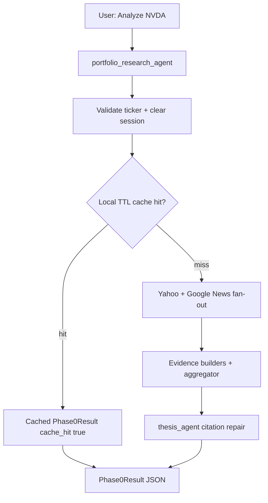

# FolioTracker Product Requirements Document (PRD)

**Product:** FolioTracker — AI portfolio and stock research on [Google ADK](https://adk.dev/)  
**Status:** Thin Phase 2 — SEC specialist (2A) done; scoring (2B) next; Phase 1 complete on the Phase 0 cited-thesis spine  
**Audience:** Executives (vision, roadmap, risk) and engineers (contracts, acceptance criteria, phase boundaries)  
**Last updated:** 2026-07-24

**Related:** [architecture.md](architecture.md) · [implementation-status.md](implementation-status.md) · [TODOS.md](../TODOS.md)

---

## Table of contents

1. [Overview](#1-overview)
2. [Problem and opportunity](#2-problem-and-opportunity)
3. [Goals and non-goals](#3-goals-and-non-goals)
4. [Personas and primary jobs](#4-personas-and-primary-jobs)
5. [User features](#5-user-features)
6. [System features](#6-system-features)
7. [Core user journey](#7-core-user-journey)
8. [Success metrics](#8-success-metrics)
9. [Product principles](#9-product-principles)
10. [Roadmap](#10-roadmap)
11. [Constraints and compliance](#11-constraints-and-compliance)
12. [Open questions](#12-open-questions)
13. [Related docs](#13-related-docs)

---

## 1. Overview

FolioTracker turns a ticker symbol into **structured, citable research**: an evidence bundle grounded in live market and news sources, plus an investment thesis where every material claim cites evidence IDs. The product is deliberately **evidence-first** — LLMs reason over structured findings; they do not invent numbers or hide missing data.

Today the product ships locally via `adk web` / `adk run app`. The user asks to analyze a ticker (for example, `Analyze NVDA`); the system returns a `Phase0Result` JSON payload with status, evidence (including conflicts when sources disagree), a cited thesis when possible, a fixed non-advice disclaimer, cache metadata, and a request id for log correlation.

**What exists now (Phase 0 + 1):** single-ticker research from Yahoo Finance metrics and Google News RSS headlines, merged by a deterministic evidence aggregator, with disagreement surfaced as `evidence.conflicts`.

**What comes next (Phase 2+):** deeper product capabilities (SEC filings, deterministic scorecards, multi-ticker portfolio risk) and later platform work (custom UI/API, observability, production deploy). See [Roadmap](#10-roadmap) and [Open questions](#12-open-questions).

How the system is built lives in [architecture.md](architecture.md). What is implemented vs stub lives in [implementation-status.md](implementation-status.md). Deferred work lives in [TODOS.md](../TODOS.md).

---

## 2. Problem and opportunity

### Problem

Equity research for individuals and small teams is fragmented across terminals, filings sites, news feeds, and chatbots. Generative AI makes narrative research cheap, but most chatbot answers are **unverifiable**: numbers may be hallucinated, sources are opaque, and partial data failures are silent. There is no shared **evidence contract** that downstream analysis, scoring, and portfolio tools can reuse.

### Opportunity

FolioTracker owns the load-bearing spine: **fetch → evidence → cite → (later) score / portfolio**. Once that spine is trusted, specialists (news, SEC, technicals), scorecards, and multi-ticker risk become composition over the same contracts — not one-off prompts.

### Product bet

Users will prefer a labeled, citable, sometimes-partial result over a fluent but ungrounded essay. Trust compounds when every claim points at evidence and disagreements are visible.

---

## 3. Goals and non-goals

### Goals

| Goal | Why it matters |
|------|----------------|
| Cite-first research | Material claims must reference evidence IDs present in the bundle |
| Honest degradation | Missing or conflicting data → `partial` / `error`, never a silent fake thesis |
| Deterministic calc layer | Scores, math, and conflict detection are services — never LLM arithmetic |
| Eval-first delivery | Unit tests and LLM eval fixtures gate each phase before shipping reasoning changes |
| Reusable spine | New specialists and portfolio features plug into evidence + schemas |

### Non-goals (current product)

| Non-goal | Clarification |
|----------|---------------|
| Investment advice | Output is informational/educational only; fixed disclaimer always present |
| Brokerage / order execution | No trading, accounts, or order routing |
| Full research terminal | No custom UI yet; delivery is ADK chat + JSON |
| Production multi-tenant SaaS | Local process + file cache only until Phase 3 |
| Web scraping of article bodies | Phase 1 news is RSS headlines + URLs only |
| Pretending stubs are live | Scaffold agents/tools stay marked Todo until implemented |

---

## 4. Personas and primary jobs

| Persona | Primary job | Current surface |
|---------|-------------|-----------------|
| Individual investor / power user | “Give me a grounded take on this ticker I can verify” | `adk web` chat → JSON result |
| Research analyst (dogfood) | Stress citation quality, conflicts, and partial paths | Chat + unit tests + on-demand evals |
| Portfolio manager (future) | Multi-ticker concentration and correlation-aware risk | Planned Phase 2 |
| Platform engineer (future) | Host API/UI, observe latency and error rates | Planned Phase 3 |

**Primary job-to-be-done (now):** Given one ticker, return evidence + cited thesis I can trust enough to continue my own research.

**Secondary job-to-be-done (near-term):** See when financial metrics and headlines disagree without reading raw tool dumps.

**Future job-to-be-done:** Score and compare names; understand portfolio-level risk from the same evidence spine.

---

## 5. User features

Capabilities the human experiences. Separate from [system features](#6-system-features).

### 5.1 Shipped (Phase 0–1)

| Feature | What the user gets | Acceptance notes |
|---------|--------------------|------------------|
| Single-ticker analysis | Ask e.g. `Analyze NVDA`; receive structured research | Ticker validated before tools run |
| Structured research payload | Status, evidence bundle, thesis (when available), error message when failed | Contract: `Phase0Result` |
| Cited thesis | Summary + material claims each citing evidence IDs | Uncited / dangling citations fail closed after one repair |
| Source disagreement | Conflicts listed under `evidence.conflicts` | JSON-first; no custom conflicts UI yet |
| Fast repeat lookup | Same ticker within TTL returns prior result quickly | `cache_hit=true`; new `request_id` per serve |
| Always-on disclaimer | Non-advice copy on every response including errors | Fixed string; not optional |
| Honest status labels | `ok` / `partial` / `error` | Partial on gaps/conflicts; error when research cannot ship |

### 5.2 Planned (Phase 2–3)

| Feature | What the user gets | Phase | Status |
|---------|--------------------|-------|--------|
| Filings-aware research | SEC filing context in the same result as metrics + news | 2 | Planned |
| Deterministic scorecard | Growth / Value / Moat / Risk / … scores on reports | 2 | Planned |
| Portfolio view | Multi-ticker concentration and correlation-aware risk | 2 | Planned (XL; sequencing open) |
| Session continuity | Richer memory across research sessions | 2 | Planned (P3) |
| First-party research UI / API | Use FolioTracker without living in ADK chat | 3 | Planned |
| Hosted product | Deployed service with runbooks and smoke checks | 3 | Planned |

Planned items are **not** committed scope until sequenced in [TODOS.md](../TODOS.md); see [Open questions](#12-open-questions).

---

## 6. System features

Platform capabilities engineers build behind the user experience. Separate from [user features](#5-user-features).

### 6.1 Shipped (Phase 0–1)

| Feature | Role | Contract / location |
|---------|------|---------------------|
| Yahoo Finance tool | Fetch financial metrics (no LLM) | `app/tools/finance/yahoo_finance.py` → `FinancialMetrics` |
| Google News RSS tool | Fetch headlines + URLs (no API key, no LLM) | `app/tools/news/google_news.py` → `NewsBatch` |
| Evidence from metrics | Pure Python: metrics → `Evidence` (`type=financial`, confidence `0.95`) | `evidence_from_metrics` |
| Evidence from news | Pure Python: articles → `Evidence` (`type=news`, confidence `0.7`) | `evidence_from_news` |
| Evidence aggregator | Dedupe, news cap, `EvidenceConflict`, bundle status rules | `aggregate_evidence` |
| Pipeline fan-out | Yahoo + news via thread pool; news-only failure → financial `partial` | `phase0_pipeline` |
| Thesis agent | Sole LLM step; optional bull/bear/risks/conviction; one citation repair | `thesis_agent` |
| Local TTL cache | File-backed `Phase0Result` cache (`ok`/`partial` only) | `.cache/foliotracker/phase0/` |
| Session clear (5A) | New ticker clears prior evidence/thesis session keys | `phase0_session` |
| Schema invariants | Claim `evidence_ids` ⊆ bundle item ids when status ok/partial | `Phase0Result`, `InvestmentThesis` |
| CI unit tests | Default `pytest tests/unit` | No LLM required |
| On-demand LLM evals | Groundedness / citation fixtures | `python -m evaluations.phase0.run` |

**Output contract engineers must preserve** (`Phase0Result`):

- Always set: `ticker`, `status`, `disclaimer`, `cache_hit`, `request_id`
- On `ok`/`partial`: evidence bundle present; every claim citation resolves to an evidence id
- Never cache `status=error`
- On cache hit: serve prior payload with `cache_hit=true` and a **new** `request_id`

**Source trust ladder (today):**

| Source | Confidence | Notes |
|--------|------------|-------|
| Yahoo Finance metrics | `0.95` | Primary financial source |
| Google News RSS | `0.7` | Headlines + URLs only |
| SEC filings | — | Deferred (Phase 2) |

### 6.2 Planned (Phase 2–3)

| Feature | Role | Phase | Status |
|---------|------|-------|--------|
| SEC EDGAR / XBRL tools | Structured filings fetch/parse (no LLM in tools) | 2 | Planned |
| Filings evidence builder | `Evidence` (`type=sec`) + aggregator conflict topics | 2 | Planned |
| Scoring service | Deterministic Growth / Value / Moat / Risk / … → `Scorecard` | 2 | Planned |
| Portfolio schemas + risk services | Batch evidence, concentration, correlation | 2 | Planned |
| Memory beyond TTL files | Ticker / company / session / portfolio memory | 2 | Planned (P3) |
| Observability backends | Metrics, traces, alerts beyond local logs | 3 | Planned |
| Production deploy + runbooks | Hosted ADK/API, env, smoke, rollback | 3 | Planned |

**Engineering invariant for Phase 2 scoring:** formulas and ranges land with unit tests **before** any agent consumes scores. LLMs must not perform score arithmetic.

---

## 7. Core user journey

**Happy path:** metrics + news → evidence (optional conflicts) → cited thesis → `status=ok` or `partial` → cache write.

**Shadow paths users must still understand:**

| Path | User-visible outcome |
|------|----------------------|
| Blank / invalid ticker | Reject before tools; ask / error |
| Ticker not found / Yahoo failure | `status=error`, no thesis |
| News fails, Yahoo ok | Financial-only bundle, often `partial` |
| Conflicts detected | Conflicts in evidence; typically `partial` |
| Thesis uncited after repair | `status=error`, no thesis shipped |
| Repeat within TTL | Fast return, `cache_hit=true` |

---

## 8. Success metrics

| Metric | Target / signal | Audience |
|--------|-----------------|----------|
| Citation groundedness | Eval cases: claims cite only fixture evidence IDs; no invented numbers | Eng + product quality |
| Citation coverage | Material claims have ≥1 evidence id; dangling ids = fail | Eng |
| Honest labeling | Empty/missing data never returns a confident fake thesis | Exec trust |
| Conflict visibility | Disagreements appear in `evidence.conflicts` when heuristics fire | Product |
| Cache effectiveness | Repeat ticker within TTL → `cache_hit=true`; live path collapsed | Cost / UX |
| Latency (order of magnitude) | Cache hit &lt;50ms; live path dominated by Yahoo + thesis (seconds–tens of seconds) | Eng |
| Partial vs silent failure | Tool/news gaps → `partial` or `error` with message | Exec + eng |
| Unit CI green | `pytest tests/unit` is the default gate | Eng |

LLM evals remain **on-demand** (need `GOOGLE_API_KEY`); they are not the default CI gate.

---

## 9. Product principles

These are non-negotiable product and engineering rules (see also architecture):

1. **Agents reason; tools fetch; services calculate.** Agents must not perform HTTP or arithmetic.
2. **Schemas are the contracts.** Free-form agent prose is not the system of record.
3. **Evidence over vibes.** Downstream steps consume `Evidence`, not upstream chat text.
4. **Eval-first.** Tests and eval fixtures are reviewed before phase implementation code.
5. **Partial failure is visible.** Missing data yields a degraded, labeled result — never a silent fake thesis.

---

## 10. Roadmap

Phased delivery. Shipped phases are product fact; later phases are planned until sequenced in TODOS.

| Phase | Theme | User outcome | System outcome | Status |
|-------|-------|--------------|----------------|--------|
| **0** | Thin vertical slice | Single-ticker cited thesis from financials | Yahoo → evidence → thesis → TTL cache | **Shipped** |
| **1** | Evidence spine expansion | News context + visible source conflicts | News tool, merge aggregator, conflicts on result | **Shipped** (2026-07-24) |
| **2** | Product depth (thin) | Filings context + scorecards | SEC specialist → scoring service | **2A done; 2B next** |
| **3** | Platform | First-party UI/API, hosted product | Observability, deploy/rollback runbooks | **Planned** |

### Phase 2 sequence (locked 2026-07-24)

| Order | Item | Effort | Status |
|-------|------|--------|--------|
| **2A** | SEC specialist agent (EDGAR metadata) | L | **Done** (2026-07-24) |
| **2B** | Scoring service (Growth / Value / Moat / Risk / …) | M | Next |

**Deferred past thin Phase 2:** portfolio / correlation (XL), cache / memory (P3).

### Phase 3 backlog (planned)

- Custom HTTP API and/or minimal research UI (design review before UI)
- Observability backends (metrics, traces, alerts)
- Production deploy + rollback runbooks

North-star (12-month ideal): full evidence graph, portfolio risk, scoring, and memory — composed on the same spine. FolioTracker does not pretend that cathedral is built today.

---

## 11. Constraints and compliance

| Constraint | Detail |
|------------|--------|
| Not advice | Fixed disclaimer on every `Phase0Result`: *“FolioTracker output is for informational and educational purposes only. It is not investment, legal, or tax advice. Do your own research.”* |
| Local-only deploy (now) | `adk web` / `adk run app`; no cloud multi-tenant product yet |
| Secrets | `GOOGLE_API_KEY` (and related) only in `.env`; never logged |
| Ticker validation | Strict pattern before tool calls or prompt inclusion |
| News surface | RSS headlines + URLs only (limits prompt-injection from scraped bodies) |
| Cache hygiene | Never cache errors; clear `.cache/foliotracker/phase0/` after breaking schema upgrades if needed |
| Stub honesty | Unimplemented agents/tools remain stubs until a phase lands them |

---

## 12. Open questions

### Resolved (2026-07-24)

1. **Phase 2 in-scope set** → Thin Phase 2: SEC + scoring only; portfolio + memory deferred.
2. **Order** → **SEC → scoring** (2A then 2B).

### Still open

1. **Portfolio timing** — Start only after single-ticker spine + scoring are trusted (recommended), or earlier thin multi-ticker batch without scores?
2. **Scoring dimensions v1** — Which subset of Growth / Value / Moat / Risk ship first, and what formula ranges?

---

## 13. Related docs

| Doc | Purpose |
|-----|---------|
| [architecture.md](architecture.md) | How the system is designed (flows, schemas, failures, ADK mapping) |
| [implementation-status.md](implementation-status.md) | What is Done / Partial / Todo vs architecture |
| [TODOS.md](../TODOS.md) | Deferred Phase 2+ work items |
| [evaluations/phase0/README.md](../evaluations/phase0/README.md) | How to run on-demand LLM evals |
| [README.md](../README.md) | Setup, run, and design principles |

---

## Changelog

| Date | Change |
|------|--------|
| 2026-07-24 | Phase 2A shipped (SEC EDGAR); 2B scoring remains next |
| 2026-07-24 | Lock thin Phase 2: SEC (2A) → scoring (2B); resolve open sequencing questions |
| 2026-07-24 | Initial PRD: TOC, user vs system features, Phase 0/1 shipped, Phase 2/3 planned, open sequencing questions |
