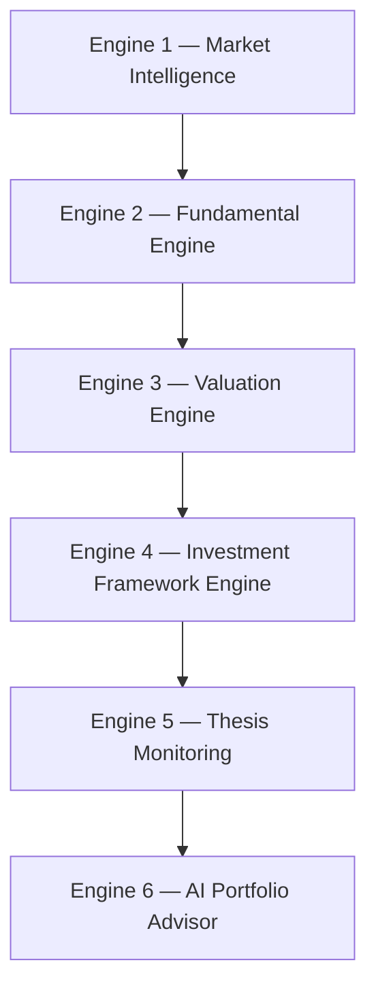
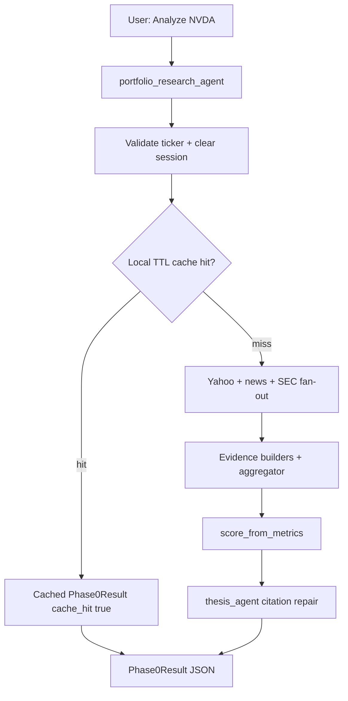

# FolioTracker Product Requirements Document (PRD)

**Product:** FolioTracker — **Portfolio Intelligence**: an AI Investment Operating System on [Google ADK](https://adk.dev/)  
**Tagline:** *Evidence-based investing for busy professionals.* (alternate: *The investment copilot that monitors your portfolio using the world's best investing frameworks.*)  
**Status:** Thin Phase 2 + **2C done**; watchlist + Risk v2 shipped; **Daily Decision Brief Slice 1 + triage dashboard shipped**; **flexible ticker intake shipped**; **Thesis T1–T3 shipped** (Framework + Valuation + Monitoring)  
**Audience:** Executives (vision, roadmap, risk) and engineers (contracts, acceptance criteria, phase boundaries)  
**Last updated:** 2026-08-07

**Related:** [architecture.md](architecture.md) · [implementation-status.md](implementation-status.md) · [TODOS.md](../TODOS.md)

---

## Table of contents

1. [Overview](#1-overview) (incl. Portfolio Intelligence vision and six-engine architecture)
2. [Problem and opportunity](#2-problem-and-opportunity)
3. [Goals and non-goals](#3-goals-and-non-goals)
4. [Personas and primary jobs](#4-personas-and-primary-jobs)
5. [User features](#5-user-features) (incl. Daily Decision Brief and Thesis landing page)
6. [System features](#6-system-features)
7. [Core user journey](#7-core-user-journey)
8. [Success metrics](#8-success-metrics)
9. [Product principles](#9-product-principles)
10. [Roadmap](#10-roadmap)
11. [Constraints and compliance](#11-constraints-and-compliance)
12. [Open questions](#12-open-questions)
13. [Related docs](#13-related-docs)

---

## 1. Overview

### 1.1 Vision — Portfolio Intelligence

FolioTracker is evolving from a portfolio tracker into an **AI Investment Operating System**. Working name: **Portfolio Intelligence**.

Most portfolio applications answer: *"What happened to my stocks?"*  
Portfolio Intelligence answers: **"What should I think about my portfolio today?"**

**Core philosophy — frameworks as lenses.** Instead of following one investing style, the application continuously evaluates every holding through multiple proven investment frameworks. Benjamin Graham is never the headline; he is one of many engines:

> Benjamin Graham · Warren Buffett · Peter Lynch · Joel Greenblatt · Quality Investing · Growth at a Reasonable Price (GARP) · Financial Strength · Momentum · Risk Management · Capital Allocation

Each framework is another "lens" through which a company is evaluated. The user is never forced into one philosophy; each framework contributes **evidence** rather than dictating the final rating. The platform does not tell users **how to invest** — it presents evidence-based, easy-to-digest assessments for professionals who don't have time to read every earnings report or financial statement.

**Product mission — five morning questions.** Help busy professionals answer every morning:

1. Has my investment thesis changed?
2. Is this company becoming stronger or weaker?
3. Am I paying too much?
4. Is there hidden risk?
5. Should I buy more, hold, trim, or research further?

### 1.2 Six-engine architecture

Portfolio Intelligence is six AI engines working together:



| Engine | Answers | Product surface | Status |
|--------|---------|-----------------|--------|
| 1. Market Intelligence | "What changed that matters?" (not a news feed) | **Brief page — shipped, preserved unchanged**; event enrichment (impact, confidence, affected frameworks, thesis impact) is additive Brief E1 | Shipped (E1 planned) |
| 2. Fundamental Engine | Is the company becoming stronger or weaker? | Thesis landing page | Planned (T1+) |
| 3. Valuation Engine | Am I paying too much? Multiple simultaneous valuations | Thesis landing page | **Shipped (T2)** |
| 4. Investment Framework Engine | How does each philosophy score this stock? | Thesis landing page | **Shipped (T1)** |
| 5. Thesis Monitoring | Has my thesis changed? (monitor thesis, not price) | Thesis landing page | **Shipped (T3)** |
| 6. AI Portfolio Advisor | Buy more, hold, trim, or research further — with reasoning + confidence | Thesis landing page | **Shipped (T4)** |

The shipped **Daily Decision Brief is carried into this structure unchanged** as the Engine 1 surface: its contracts, generator, triage dashboard, and acceptance criteria in [5.2](#52-planned--daily-decision-brief-approach-b-office-hours-2026-07-31) remain authoritative. The new **Thesis landing page** ([5.4](#54-planned--thesis-landing-page-portfolio-intelligence-engines-26)) replaces the current embedded thesis surface and hosts Engines 2–6; slices are sequenced in the [Roadmap](#10-roadmap).

### 1.3 Evidence-first spine (what exists now)

FolioTracker turns a ticker symbol into **structured, citable research**: an evidence bundle grounded in live market and news sources, plus an investment thesis where every material claim cites evidence IDs. The product is deliberately **evidence-first** — LLMs reason over structured findings; they do not invent numbers or hide missing data. Every Portfolio Intelligence engine composes over this same spine.

Today the product ships locally via `adk web` / `adk run app`. The user asks to analyze a ticker (for example, `Analyze NVDA`); the system returns a `Phase0Result` JSON payload with status, evidence (including conflicts when sources disagree), a cited thesis when possible, a fixed non-advice disclaimer, cache metadata, and a request id for log correlation.

**What exists now (Phase 0–2C):** single-ticker research from enriched Yahoo Finance fundamentals (profile, returns, BS/CF, trailing/forward P/E), Google News RSS headlines, SEC EDGAR filing metadata + XBRL companyfacts, and optional Alpha Vantage OVERVIEW fill-gaps for forward/market fields when keyed. Evidence aggregator surfaces `evidence.conflicts`; `scorecard` + `fundamentals` on `Phase0Result`. Dual cache: whole-result TTL plus per-source TTL/quota. Yahoo failure softens to `partial` when merged fundamentals pass the min field checklist.

**What comes next:** Thesis T5 (Investment OS Score + portfolio rollup); Brief dogfood Assignment (≤30m); then Phase 3 evidence deepen or Brief Slice 1b/2. See [Roadmap](#10-roadmap) and [TODOS.md](../TODOS.md).

How the system is built lives in [architecture.md](architecture.md). What is implemented vs stub lives in [implementation-status.md](implementation-status.md). Deferred work lives in [TODOS.md](../TODOS.md).

---

## 2. Problem and opportunity

### Problem

Equity research for individuals and small teams is fragmented across terminals, filings sites, news feeds, and chatbots. Generative AI makes narrative research cheap, but most chatbot answers are **unverifiable**: numbers may be hallucinated, sources are opaque, and partial data failures are silent. There is no shared **evidence contract** that downstream analysis, scoring, and portfolio tools can reuse.

### Opportunity

FolioTracker owns the load-bearing spine: **fetch → evidence → cite → score / portfolio**. Once that spine is trusted, specialists (news, SEC, technicals), scorecards, and multi-ticker risk become composition over the same contracts — not one-off prompts.

### Product bet

Users will prefer a labeled, citable, sometimes-partial result over a fluent but ungrounded essay. Trust compounds when every claim points at evidence and disagreements are visible.

---

## 3. Goals and non-goals

### Goals

| Goal | Why it matters |
|------|----------------|
| Cite-first research | Material claims must reference evidence IDs present in the bundle |
| Honest degradation | Missing or conflicting data → `partial` / `error`, never a silent fake thesis |
| Deterministic calc layer | Scores, math, and conflict detection are services — never LLM arithmetic |
| Eval-first delivery | Unit tests and LLM eval fixtures gate each phase before shipping reasoning changes |
| Reusable spine | New specialists and portfolio features plug into evidence + schemas |

### Non-goals (current product)

| Non-goal | Clarification |
|----------|---------------|
| Undisciplined trade advice | **Rescoped 2026-08-05:** directive guidance (buy more / hold / trim / research further, with confidence) is allowed **only** from the planned AI Portfolio Advisor (Engine 6), always paired with reasoning and the fixed disclaimer. All other surfaces stay non-directive — Brief keeps its shipped Read / Review / Monitor action model |
| Brokerage / order execution | No trading, accounts, or order routing |
| Full research terminal | ADK chat + JSON remain; watchlist dashboard v1 for multi-ticker review |
| Production multi-tenant SaaS | Local process + file cache only until Phase 3 |
| Web scraping of article bodies | Phase 1 news is RSS headlines + URLs only |
| Pretending stubs are live | Scaffold agents/tools stay marked Todo until implemented |
| Brief dissemination build (this milestone) | Email, messaging, audio, MCP recorded for completeness; **not built** until website Brief is trusted |
| Social signals in scores | Reddit/X (when added) are display-only; must not feed scorecard, risk, or Brief ranking math |

---

## 4. Personas and primary jobs

| Persona | Primary job | Current surface |
|---------|-------------|-----------------|
| Individual investor / power user | “Give me a grounded take on this ticker I can verify” | `adk web` chat → JSON result |
| Research analyst (dogfood) | Stress citation quality, conflicts, and partial paths | Chat + unit tests + on-demand evals |
| Portfolio manager (future) | Multi-ticker concentration and correlation-aware risk | Risk v2 shipped (local); position weights still deferred |
| Platform engineer (future) | Host API/UI, observe latency and error rates | Planned Phase 3 |

**Primary job-to-be-done (now):** Given one ticker, return evidence + cited thesis I can trust enough to continue my own research.

**Primary job-to-be-done (2C / dogfood):** Decide buy / hold / trim / add without a long Yahoo click-tour — richer fundamentals (returns, earnings/revenue trends, BS/CF, forward metrics) with honest gaps when a source fails.

**Secondary job-to-be-done (near-term):** See when financial metrics and headlines disagree without reading raw tool dumps.

**Near-term job-to-be-done (Brief):** Across ~40 Held + Watched names, identify **what requires attention today in ≤2 minutes** (High / Medium / Quiet triage with Impact Score, why-it-matters, suggested action, and sources). Full morning ritual still targets **≤30 minutes** (vs ~4h of Yahoo + broker tabs) for deeper reads — without auto trade advice.

**Near-term job-to-be-done (Thesis):** Answer the five morning questions per holding through multiple framework lenses — framework scores, valuations, thesis-change verdicts, and advisor guidance — without reading every earnings report or financial statement.

**Future job-to-be-done:** Disseminate the same Brief object via messaging, audio, MCP, and email once the website Brief is trusted; optional social/earnings-call sections as display-only context.

---

## 5. User features

Capabilities the human experiences. Separate from [system features](#6-system-features).

### 5.1 Shipped (Phase 0–2C.2)

| Feature | What the user gets | Acceptance notes |
|---------|--------------------|------------------|
| Single-ticker analysis | Ask e.g. `Analyze NVDA`; receive structured research | Ticker validated before tools run |
| Structured research payload | Status, evidence bundle, thesis (when available), scorecard + fundamentals (when available), error message when failed | Contract: `Phase0Result` |
| Cited thesis | Summary + material claims each citing evidence IDs | Ships only with ≥1 material claim citing bundle evidence IDs; empty claims or uncited/dangling citations after one repair → fail closed (`status=error`); evidence may still be returned |
| Source disagreement | Conflicts listed under `evidence.conflicts` | JSON-first; no custom conflicts UI yet |
| Filings-aware research | SEC filing metadata in the same result as metrics + news | EDGAR metadata only (form, dates, accession, index URL); no full-document scrape |
| Enriched fundamentals | Forward P/E, returns, earnings/revenue series, BS/CF summaries on result | Yahoo + SEC XBRL merge (`Phase0Result.fundamentals` + `field_provenance`) |
| Resilient multi-source data | Yahoo failure → `partial` when merge meets min field checklist | Soften gate: `has_minimum_fundamentals` |
| Deterministic scorecard | Growth / Value / Profitability / Moat / Risk scores (0–100 or null) | Pure Python from Yahoo metrics; `execution_score` null in v1; never LLM arithmetic |
| Per-source freshness | Yahoo / news / SEC refresh on independent TTLs + soft rate budgets | `.cache/foliotracker/sources/{source_id}/`; whole-result TTL still skips full pipeline |
| Fast repeat lookup | Same ticker within result TTL returns prior result quickly | `cache_hit=true`; new `request_id` per serve |
| Always-on disclaimer | Non-advice copy on every response including errors | Fixed string; not optional |
| Honest status labels | `ok` / `partial` / `error` | Partial on gaps/conflicts; error when research cannot ship; thesis-stage failures use stable `error_code` |

### 5.2 Planned — Daily Decision Brief (Approach B, office-hours 2026-07-31)

| Feature | What the user gets | Phase | Status |
|---------|--------------------|-------|--------|
| Daily Decision Brief (Slice 1) | Ranked material-event bullets for Held ∪ Watched (dedupe; Held wins), optional source URLs, metrics strip, Generate today, calm whole-Brief empty | Brief | **Shipped** (2026-08-03) |
| Brief triage dashboard | Impact Score, High/Medium/Quiet, filters, quiet list, morning digest strip, history timeline, heat map, stock drawer, insight modes (`BRIEF_INSIGHT_MODE`) | Brief | **Shipped** (2026-08-04) |
| Brief informs decisions | Surfaces catalysts that inform trim / add / promote-to-watch | Brief | No auto buy/trim actions in v1 |
| Brief history (minimal) | Last N=14 Brief snapshots persisted; timeline browse | Brief | **Shipped** (store 2026-08-03; browse 2026-08-04) |
| Brief dissemination channels | Same Brief object via messaging apps, audio soundbite, MCP, email | Brief+ | **Recorded only** — build after website Brief trusted |
| Social signals section | Reddit/X (etc.) in a **separate** report section | Brief+ | **Phase-next**; never feeds scores/ranking/risk |
| Earnings-call summaries | Call digests as citeable bullets when available | Brief+ | **Phase-next** |

**Brief v1 acceptance (Slice 1):**
- Universe: Held ∪ Watched snapshot at Generate time; one row per ticker if both.
- Gate: \|daily return\| ≥ 5% **OR** classified material event in rolling 24h (news-only events bypass move gate). Daily return = prior regular-session close → latest available regular-session close (blocking spike: confirm Yahoo history path; else news/SEC-only gate).
- Rank: `max(move_score, event_severity)`; hard cap **15** tickers; ≤**5** bullets/ticker (severity then recency).
- Trust: every displayed bullet has `source_url` and/or `evidence_id`; Slice 1 bullets are evidence titles (no LLM phrasing — optional LLM is Slice 1b, default off); reuse evidence IDs + per-source cache via `cached_fetch` / `evidence_from_*` (not full `run_phase0_research`).
- UX: `PrimaryNav` includes **Brief**; list/table rows (not cards); sync Generate cache-first (~60s wall budget, bounded pool); `generation_status` complete/stale/partial; per-ticker `ok`/`partial`/`unavailable`; disclaimer on; dogfood miss log.
- Success bar: ritual **≤30 minutes** (vs ~4h); founder-logged material misses tracked for 1-week dogfood.

Design: `~/.gstack/projects/schohan-foliotracker/shailenderchohan-main-design-20260731-024904.md` (APPROVED).

### 5.3 Planned — Flexible ticker intake

| Feature | What the user gets | Phase | Status |
|---------|--------------------|-------|--------|
| Flexible ticker intake | Add many tickers without one-by-one typing: CSV upload, screenshot/OCR, speech, paste of free text / broker exports | Watchlist | **Shipped** (2026-08-03) |
| Intake dedupe | Tickers already on Held or Watched are skipped (idempotent); invalid symbols reported, not silently invented | Watchlist | **Shipped** |

**Intake v1 acceptance:**
- Channels (ship at least CSV + paste day-1; screenshot OCR and speech as same parser behind alternate capture): user supplies unstructured or semi-structured input → system extracts candidate ticker symbols → validates via existing ticker rules → adds to chosen list (Held or Watched).
- Dedupe: normalize (case/whitespace); if ticker already in Held ∪ Watched, **ignore** (no error, no list move, no research re-run). Report counts: `added` / `skipped_duplicate` / `rejected_invalid`.
- No auto-research on bulk add (membership-first; refresh remains explicit) — preserves watchlist cost model.
- Fail closed on empty extract: clear “no tickers found” message; never invent symbols from OCR/speech noise.

### 5.4 Planned — Thesis landing page (Portfolio Intelligence, Engines 2–6)

Replaces the current embedded thesis surface (Watchlist one-liner + detail-panel text) with a dedicated **Thesis** landing page beside Brief: `PrimaryNav` becomes `Watchlist | Risk | Brief | Thesis`. The page evaluates every Held ∪ Watched holding through multiple investment frameworks and answers the five morning questions. **The shipped Brief page is untouched** — it remains the Engine 1 surface.

| Feature | What the user gets | Slice | Status |
|---------|--------------------|-------|--------|
| Framework score table | Every stock scored against multiple investment philosophies at a glance | T1 | **Shipped** |
| Framework scorecards | Per-framework drill-down with named checks (PASS / value / rating) | T1 | **Shipped** |
| Valuation ladder | Six values per company instead of one P/E | T2 | **Shipped** |
| Net Asset Intelligence | Asset breakdown → Adjusted Net Assets vs market cap | T2 | **Shipped** |
| Margin of Safety visualization | Intrinsic vs price with % and star rating | T2 | **Shipped** |
| Thesis monitoring | Quarterly thesis-change verdicts per holding | T3 | **Shipped** |
| AI Portfolio Advisor | Directive insight (buy more / hold / trim / research) with reasoning + confidence | T4 | **Shipped** |
| AI Research button | One-click framework questions per stock | T4 | **Shipped** |
| Investment OS Score | Proprietary composite blending multiple disciplines | T5 | Planned |
| Portfolio dashboard | Portfolio health rollup counts | T5 | Planned |

The examples below are **normative acceptance references**: when a slice ships, its UI and contracts must be able to reproduce these shapes.

#### 5.4.1 Engine 2 — Fundamental Engine

Continuously evaluates company health; updates after each quarterly report. Metric catalog:

> Revenue · Revenue Growth · Gross Margin · Operating Margin · EPS · EPS Growth · FCF · ROIC · ROE · Debt · Cash · Inventory · Share Dilution · Buybacks · Dividend · Working Capital · **Altman Z-Score** · **Piotroski F-Score** · **Beneish M-Score** · Interest Coverage · Current Ratio · Quick Ratio

Metrics unavailable from current sources are shown as honest gaps (`null` / "insufficient data") — never invented.

#### 5.4.2 Engine 3 — Valuation Engine

One of the product's biggest differentiators: compute **multiple valuations simultaneously** instead of showing only P/E.

| School | Valuations |
|--------|-----------|
| **Graham** | Net Current Asset Value (NCAV) · Margin of Safety · Net-Net · Intrinsic Value · Liquidation Value · Adjusted Book Value |
| **Buffett** | Owner Earnings · Free Cash Flow Yield · ROIC · Capital Efficiency · Economic Moat Indicators |
| **Modern** | Discounted Cash Flow · Reverse DCF · EV/EBITDA · EV/FCF · PEG · Historical PE Bands · Historical PS Bands · Historical PB Bands · Sector Relative Valuation · Market Expectations Model |

Every company gets a **six-value ladder** rather than one valuation:

```
Market Price
Intrinsic Value
Liquidation Value
Replacement Value
Enterprise Value
Expected Fair Value
```

#### 5.4.3 Engine 4 — Investment Framework Engine

The unique differentiator: instead of one overall score, every stock is scored against multiple investment philosophies. Reference example:

| Framework | Score |
|-----------|-------|
| Graham Deep Value | 91 |
| Buffett Quality | 82 |
| Peter Lynch Growth | 74 |
| Greenblatt Magic Formula | 88 |
| Quality Investing | 86 |
| Dividend | 42 |
| GARP | 79 |
| Financial Strength | 93 |
| Value Trap Risk | Low |
| Bankruptcy Risk | Very Low |

This immediately explains why a stock may be attractive to different types of investors.

**Graham framework** (inspired by *The Intelligent Investor*: buy below intrinsic value, insist on a margin of safety, emphasize strong balance sheets, distinguish price from value, use conservative measures like NCAV; defensive vs enterprising investors; discipline over market emotion). Reference scorecard:

| Check | Result |
|-------|--------|
| Margin of Safety | Excellent — 34% |
| Net-Net | PASS |
| Current Ratio | 2.8 — PASS |
| Debt | Low |
| Earnings Stability | PASS |
| Dividend History | PASS |
| **Graham Score** | **91** |

**Buffett framework** evaluates: economic moat · owner earnings · ROIC · capital allocation · management quality · share repurchases · debt discipline · long-term earnings consistency.

**Peter Lynch framework** evaluates: PEG · revenue growth · earnings growth · inventory trends · expansion opportunities · industry growth · reasonable valuation.

**Greenblatt framework** evaluates: ROC · Earnings Yield · Magic Formula ranking.

**Quality Investing framework** evaluates: ROIC · gross margin · operating margin · cash conversion · capital allocation · debt · consistency.

#### 5.4.4 Engine 5 — Thesis Monitoring

Monitor **thesis**, not price. Reference example:

```
Original Thesis
  Cloud spending accelerating.
  Strong balance sheet.
  Expanding margins.
```

Every quarter the AI asks: *has anything changed?* Verdicts (closed set):

`No change | Strengthened | Slightly weaker | Broken`

This is enormously valuable for long-term investors; the thesis timeline shows every verdict with its evidence.

#### 5.4.5 Engine 6 — AI Portfolio Advisor

Generate **reasoning**, not a bare Buy/Sell. Directive conclusions are allowed here (and only here), always with reasoning and confidence. Reference example:

```
Today's Insight

LITE remains expensive.
Business quality improved.
Valuation expanded faster than fundamentals.
No thesis change.
Wait for better entry.

Confidence: 89%
```

#### 5.4.6 Net Asset Intelligence

Every company gets an Asset Breakdown:

```
Assets:      Cash · Receivables · Inventory · Factories · Land ·
             Investments · Patents · Other Assets
Subtract:    Current Debt · Long-term Debt · Lease · Other Liabilities
Produces:    Adjusted Net Assets
Compare:     Market Value vs Net Assets
```

Reference example:

```
Market Cap             48B
Adjusted Net Assets    61B
Difference             -21%
Possible Undervaluation
```

#### 5.4.7 Margin of Safety visualization

```
Intrinsic Value    $180
Market Price       $128
Margin of Safety   29%
★★★★★
```

#### 5.4.8 Portfolio dashboard (rollup)

```
Portfolio Health            92   Excellent
---------------------------------
Strong Balance Sheets       31
Weak Balance Sheets          4
Potential Value Traps        2
Significantly Undervalued    8
Overvalued                  11
High Conviction             14
Thesis Broken                1
```

#### 5.4.9 Daily Morning Brief counts (Engine 1 extension — Brief E1)

The Brief gains an **additive** portfolio-state count strip (after Thesis T3 provides the underlying signals):

```
Today's Portfolio
  Thesis Changed               2
  Valuation Improved           5
  Margin of Safety Increased   4
  Balance Sheet Weakened       1
  Risk Increased               2
  Opportunity Score            High
```

Backwards-compatible: optional fields only; shipped Brief behavior unchanged until E1 ships.

#### 5.4.10 AI Research button

Every stock offers one-click framework questions, e.g.:

- *"Why does this stock score poorly under Buffett but well under Graham?"*
- *"Why did Margin of Safety decrease?"*
- *"Which framework is most bullish?"*

Reuses the `POST /api/brief/explain` pattern: structured, fail-closed, provider-labeled.

#### 5.4.11 The Investment OS Score

Instead of a single "Graham Score", a proprietary composite blends multiple proven disciplines:

| Dimension | Weight |
|-----------|--------|
| Business Quality | 20% |
| Financial Strength | 15% |
| Valuation | 20% |
| Balance Sheet | 15% |
| Earnings Quality | 10% |
| Capital Allocation | 10% |
| Investment Framework Consensus | 5% |
| Thesis Stability | 5% |

Each underlying framework (Graham, Buffett, Lynch, Greenblatt, …) contributes **evidence rather than dictating the final rating** — methodology-agnostic while benefiting from decades of investing wisdom.

#### 5.4.12 Thesis page acceptance rules

- All framework and valuation math is **deterministic services with unit tests before any agent consumes them** (existing scoring invariant; no LLM arithmetic).
- Honest gaps: any metric/valuation the sources cannot support is `null` with an "insufficient data" label — never invented.
- LLM is used only for thesis-change narrative, advisor reasoning, and research-button answers; `THESIS_INSIGHT_MODE` mirrors `BRIEF_INSIGHT_MODE` (`deterministic | canned | llm`, fail-closed) and the provider label is always visible.
- Directive phrasing appears only in Advisor output, always with reasoning + confidence.
- Fixed disclaimer always present.
- Framework scores cite the underlying evidence/fundamentals fields they were computed from.

#### 5.4.13 Future framework modules (Phase-next)

Recorded for the Investment Intelligence Platform trajectory — not sequenced yet:

- **Howard Marks**: market cycle positioning and risk asymmetry
- **Charlie Munger**: qualitative business quality and competitive durability
- **Michael Mauboussin**: expectations investing and capital allocation
- **Fama-French**: factor exposures (value, quality, profitability, momentum, size)
- **Behavioral Finance**: concentration risk, overconfidence, recency bias, confirmation-bias alerts
- **Macro Overlay**: interest-rate sensitivity, recession resilience, inflation exposure, geopolitical risk

### 5.5 Planned (deferred / Phase 3)

| Feature | What the user gets | Phase | Status |
|---------|--------------------|-------|--------|
| Portfolio / watchlist dashboard | Fast buy/trim/add read across held + watched names | — | **Shipped v1** (local UI + API) |
| Portfolio risk view | Multi-ticker concentration and correlation-aware risk | — | **Risk v2 shipped** (equal-weight concentration + top pairwise correlations) |
| Session continuity | Richer memory across research sessions | — | Deferred past thin Phase 2 (P3) |
| First-party research UI / API | Use FolioTracker without living in ADK chat | 3 | Planned (watchlist/Brief/Risk already local UI) |
| Hosted product | Deployed service with runbooks and smoke checks | 3 | Planned |

Planned items are sequenced in [TODOS.md](../TODOS.md); 2C contracts are locked in [architecture.md](architecture.md).

---

## 6. System features

Platform capabilities engineers build behind the user experience. Separate from [user features](#5-user-features).

### 6.1 Shipped (Phase 0–2C.2)

| Feature | Role | Contract / location |
|---------|------|---------------------|
| Yahoo Finance tool | Fetch enriched fundamentals (no LLM) | `yahoo_finance.py` → `FinancialMetrics` / `FundamentalsSnapshot` (profile, returns, BS/CF, forward P/E) |
| Google News RSS tool | Fetch headlines + URLs (no API key, no LLM) | `app/tools/news/google_news.py` → `NewsBatch` |
| SEC EDGAR tool | Fetch recent filing metadata (User-Agent required; no LLM) | `app/tools/filings/sec_edgar.py` → `SecFilingsBatch` |
| DataSource registry | `source_id`, trust, TTL, local rate budget, timeout, enabled | `source_registry` (yahoo / google_news / sec_edgar) |
| Per-source cache | File cache ticker × source; independent refresh; soft budgets | `source_cache` + `cached_fetch` |
| Evidence from metrics | Pure Python: metrics → `Evidence` (`type=financial`, confidence `0.95`) | `evidence_from_metrics` |
| Evidence from news | Pure Python: articles → `Evidence` (`type=news`, confidence `0.7`) | `evidence_from_news` |
| Evidence from filings | Pure Python: filings → `Evidence` (`type=sec`, confidence `0.9`) | `evidence_from_filings` |
| Evidence aggregator | Dedupe, news/SEC caps, `EvidenceConflict`, bundle status rules | `aggregate_evidence` |
| Scoring service | Pure Python: metrics → `Scorecard` (0–100 or null per dim) | `score_from_metrics` |
| Pipeline fan-out | Yahoo + news + SEC filings + XBRL via `cached_fetch`; merge; Yahoo failure softens when min set met; score before thesis | `phase0_pipeline` |
| SEC XBRL tool | Companyfacts → statement/EPS/margins fundamentals | `sec_xbrl` |
| Fundamentals merge | Fill-nulls by trust; `field_provenance`; field conflicts | `merge_fundamentals` |
| Thesis agent | Sole LLM step; optional bull/bear/risks/conviction; one citation repair | `thesis_agent` |
| Local TTL cache | File-backed `Phase0Result` cache (`ok`/`partial` only) | `.cache/foliotracker/phase0/` |
| Session clear (5A) | New ticker clears prior evidence/scorecard/fundamentals/thesis session keys | `phase0_session` |
| Schema invariants | Claim `evidence_ids` ⊆ bundle item ids when status ok/partial | `Phase0Result`, `InvestmentThesis` |
| CI unit tests | Default `pytest tests/unit` | No LLM required |
| On-demand LLM evals | Groundedness / citation fixtures | `python -m evaluations.phase0.run` |

**Output contract engineers must preserve** (`Phase0Result`):

- Always set: `ticker`, `status`, `disclaimer`, `cache_hit`, `request_id`
- On `ok`/`partial`: evidence bundle present; every claim citation resolves to an evidence id; thesis has ≥1 material claim
- Optional `scorecard: Scorecard | null` — null when no scorable metrics; null dims ok; never invent scores
- Optional `fundamentals: FinancialMetrics | null` — enriched Yahoo snapshot (P/E, returns, BS/CF, …) for debug and report rendering
- On `error`: set user-readable `error_message` and stable `error_code` (e.g. `THESIS_EMPTY_CLAIMS`); thesis-stage failures may still include `evidence`, `scorecard`, and `fundamentals`
- Never cache `status=error`
- On cache hit: serve prior payload with `cache_hit=true` and a **new** `request_id`
- ADK chat: agent must show the **complete** tool JSON (including `fundamentals`) before any prose summary

**Source trust ladder (today):**

| Source | Confidence | Notes |
|--------|------------|-------|
| Yahoo Finance metrics | `0.95` | Primary financial source today (enriched 2C.2; also feeds scores) |
| SEC EDGAR filing metadata | `0.9` | Primary filings; metadata only in 2A |
| SEC XBRL statement facts | `0.95` planned | 2C slice 3 — preferred for BS/CF truth |
| Google News RSS | `0.7` | Headlines + URLs only |
| Alpha Vantage | `0.85` | Optional OVERVIEW fill-gaps for forward/market fields (key required) |

### 6.2 Planned — Daily Decision Brief

| Feature | Role | Phase | Status |
|---------|------|-------|--------|
| `DailyBrief` / `BriefTicker` / `BriefBullet` schemas | Contract for ranked triage; bullets cite `evidence_ids` and/or `source_url`; Impact Score + insight block; `generation_status` + per-ticker status | Brief | **Shipped** |
| Brief generator service | Cache-first gate/rank over Held∪Watched; keyword event categories; insight provider `deterministic`/`canned`/`llm` (fail-closed) | Brief | **Shipped** (`BRIEF_INSIGHT_MODE`) |
| Brief HTTP API + triage UI | Generate; history; explain; High/Medium/Quiet inbox rows; miss log | Brief | **Shipped** |
| Dissemination adapters | Email / messaging / audio / MCP over same Brief JSON | Brief+ | Recorded only — not built this milestone |
| Social ingest (display-only) | Separate section; excluded from scores and Brief ranking | Brief+ | Phase-next |

### 6.3 Planned — Flexible ticker intake

| Feature | Role | Phase | Status |
|---------|------|-------|--------|
| Ticker extract + normalize service | Parse CSV / free text / OCR text / speech transcript → candidate tickers; validate; dedupe against membership | Watchlist | **Shipped** |
| Bulk add API | `POST` batch add with `added` / `skipped_duplicate` / `rejected_invalid` counts; never moves existing membership on duplicate | Watchlist | **Shipped** (`/api/watchlist/intake`) |
| Intake UI affordances | CSV file picker, paste area; screenshot and mic as capture → same extract path | Watchlist | **Shipped** |

### 6.4 Planned — Portfolio Intelligence engines (Thesis page)

Follows the Brief architectural template: Pydantic schemas → deterministic services (LLM fail-closed) → ring-store JSON → HTTP API → Svelte page. Shipped Brief contracts are not modified.

| Feature | Role | Slice | Status |
|---------|------|-------|--------|
| `app/schemas/thesis.py` contracts | `FrameworkScorecard`, `FrameworkCheck`, `ValuationSet`, `AssetBreakdown`, `MarginOfSafetyView`, `ThesisSnapshot`, `ThesisChange`, `ThesisMonitoring`, `AdvisorInsight`, `ThesisDashboard` (T1–T4); `InvestmentOSScore` (T5) | T1–T5 | **T1–T4 shipped**; T5 planned |
| Framework engine service | Deterministic per-framework scoring from merged fundamentals (Yahoo + SEC XBRL); Graham + Financial Strength first; remaining frameworks phased | T1+ | **Shipped (T1)** |
| Valuation service | NCAV / net-net / intrinsic / liquidation / adjusted book; owner earnings / FCF yield; DCF / reverse DCF / EV multiples / PEG / historical bands | T2 | **Shipped** (honest nulls for ROIC, bands, sector, Replacement) |
| Net asset service | Asset breakdown → Adjusted Net Assets vs market cap | T2 | **Shipped** |
| Thesis snapshot store | Per-ticker ring store (like `brief_store`); quarterly diff → change verdict | T3 | **Shipped** |
| Advisor + explain service | Directive advisor + `POST /api/thesis/explain`; reuses `THESIS_INSIGHT_MODE` | T4 | **Shipped** |
| Investment OS Score service | Deterministic composite from locked weight table | T5 | Planned |
| Thesis HTTP API + page | `GET /api/thesis`, `POST /api/thesis/generate`, `POST /api/thesis/explain`; `ThesisPage` + `thesis/*` components; `PrimaryNav` adds Thesis | T1+ | Planned |
| Brief E1 enrichment | **Additive optional** `BriefBullet` fields (impact, confidence, affected_frameworks, thesis_impact) + morning count strip; backwards-compatible; after T3 | E1 | Planned |

### 6.5 Planned (deferred / Phase 3)

| Feature | Role | Phase | Status |
|---------|------|-------|--------|
| Portfolio schemas + risk services | Batch evidence, concentration, correlation | — | **v2 done** (concentration + pairwise correlation from Yahoo history cache) |
| Memory beyond TTL files | Ticker / company / session / portfolio memory | — | Deferred past thin Phase 2 (P3) |
| Observability backends | Metrics, traces, alerts beyond local logs | 3 | Planned |
| Production deploy + runbooks | Hosted ADK/API, env, smoke, rollback | 3 | Planned |

**Engineering invariant for scoring:** formulas and ranges land with unit tests **before** any agent consumes scores. LLMs must not perform score arithmetic. Thin 2B is **service-only** (`score_from_metrics`); `scoring_agent` stays stubbed.

**2B v1 dimensions (shipped):** scale `0.0–100.0` or `null` — see [architecture.md](architecture.md) clamp anchors.

---

## 7. Core user journey



**Happy path:** metrics + news + SEC → evidence (optional conflicts) → scorecard → cited thesis → `status=ok` or `partial` → cache write.

**Shadow paths users must still understand:**

| Path | What’s missing / why | User-visible outcome |
|------|----------------------|----------------------|
| Blank / invalid ticker | Input invalid before tools | Reject / `status=error`, `error_code=INVALID_TICKER` |
| Ticker not found / Yahoo failure | Upstream financial data unavailable | `status=error`, `error_code=DATA_FETCH_FAILED`, no usable evidence |
| Empty metrics / evidence | Nothing to cite | `status=error`, `error_code=EMPTY_EVIDENCE` |
| News fails, Yahoo ok | News gap only | Financial (+ SEC) bundle, often `partial` |
| SEC fails, Yahoo ok | Filings gap only | Metrics (+ news) bundle, often `partial` |
| Conflicts detected | Sources disagree | Conflicts in evidence; typically `partial` |
| Thesis empty claims after repair | Model returned no material claims; evidence data may be fine | `status=error`, `error_code=THESIS_EMPTY_CLAIMS`, thesis null, evidence often present |
| Thesis uncited / dangling after repair | Claims lack valid evidence ids | `status=error`, `error_code=THESIS_UNCITED` or `THESIS_DANGLING_CITATION`, thesis null, evidence often present |
| Thesis generation failed | LLM empty/unusable output | `status=error`, `error_code=THESIS_GENERATION_FAILED`, thesis null, evidence often present |
| Repeat within TTL | — | Fast return, `cache_hit=true` |

---

## 8. Success metrics

| Metric | Target / signal | Audience |
|--------|-----------------|----------|
| Citation groundedness | Eval cases: claims cite only fixture evidence IDs; no invented numbers | Eng + product quality |
| Citation coverage | Material claims have ≥1 evidence id; dangling ids = fail | Eng |
| Thesis-stage labeling | Thesis failures use stable `error_code`; user `error_message` distinguishes data vs thesis failure | Eng + product |
| Honest labeling | Empty/missing data never returns a confident fake thesis | Exec trust |
| Conflict visibility | Disagreements appear in `evidence.conflicts` when heuristics fire | Product |
| Cache effectiveness | Repeat ticker within TTL → `cache_hit=true`; live path collapsed | Cost / UX |
| Latency (order of magnitude) | Cache hit &lt;50ms; live path dominated by Yahoo + thesis (seconds–tens of seconds) | Eng |
| Partial vs silent failure | Tool/news gaps → `partial` or `error` with message | Exec + eng |
| Unit CI green | `pytest tests/unit` is the default gate | Eng |

LLM evals remain **on-demand** (need `GOOGLE_API_KEY`); they are not the default CI gate.

---

## 9. Product principles

These are non-negotiable product and engineering rules (see also architecture):

1. **Agents reason; tools fetch; services calculate.** Agents must not perform HTTP or arithmetic.
2. **Schemas are the contracts.** Free-form agent prose is not the system of record.
3. **Evidence over vibes.** Downstream steps consume `Evidence`, not upstream chat text.
4. **Eval-first.** Tests and eval fixtures are reviewed before phase implementation code.
5. **Partial failure is visible.** Missing data yields a degraded, labeled result — never a silent fake thesis.
6. **Frameworks are lenses, not verdicts.** Each investment framework contributes evidence; no single philosophy dictates the rating.
7. **Directive guidance is earned, scoped, and explained.** Buy/hold/trim/research phrasing is allowed only from the AI Portfolio Advisor, always with reasoning, confidence, provider label, and disclaimer.

---

## 10. Roadmap

Phased delivery. Shipped phases are product fact; later phases are planned until sequenced in TODOS.

| Phase | Theme | User outcome | System outcome | Status |
|-------|-------|--------------|----------------|--------|
| **0** | Thin vertical slice | Single-ticker cited thesis from financials | Yahoo → evidence → thesis → TTL cache | **Shipped** |
| **1** | Evidence spine expansion | News context + visible source conflicts | News tool, merge aggregator, conflicts on result | **Shipped** (2026-07-24) |
| **2** | Product depth (thin) | Filings context + scorecards | SEC specialist → scoring service | **Complete** (2A+2B) |
| **2C** | Multi-source ingestion | Richer, resilient fundamentals | Provider port, per-source cache, Yahoo → SEC XBRL → AV | **Done** |
| **Brief** | Daily decision triage | ≤30m material-event Brief for Held+Watched | Brief schemas, generator, thin UI; dissemination recorded | **Slice 1 shipped** |
| **Thesis** | Portfolio Intelligence (Engines 2–6) | Multi-framework Thesis landing page: scores, valuations, thesis monitoring, advisor | Framework/valuation/net-asset services, thesis snapshot store, advisor, `/api/thesis*`, `ThesisPage` | **Planned (docs locked 2026-08-05)** |
| **3** | Platform | First-party deepen / hosted product | Evidence browser deepen, observability, deploy | **Planned** |

### Phase 2 sequence (locked 2026-07-24)

| Order | Item | Effort | Status |
|-------|------|--------|--------|
| **2A** | SEC specialist agent (EDGAR metadata) | L | **Done** (2026-07-24) |
| **2B** | Scoring service (Growth / Value / Moat / Risk / …) | M | **Done** (2026-07-24) |

### Phase 2C sequence (locked 2026-07-25 — Approach B1)

| Order | Item | Effort | Status |
|-------|------|--------|--------|
| Docs | Architecture / PRD / TODOS contracts | S | **Done** (2026-07-25) |
| **2C.1** | Source registry + per-source cache; wrap Yahoo/news/SEC | M | **Done** (2026-07-25) |
| **2C.2** | Yahoo fundamentals enrichment + richer schemas | M | **Done** (2026-07-25) |
| **2C.3** | Soften Yahoo-fatal + SEC XBRL fundamentals provider | L | **Done** (2026-07-25) |
| Later | Alpha Vantage OVERVIEW fill-gaps | M | **Done** (2026-07-25) |

**Deferred past Risk v2:** position weights, cache / memory (P3), Kafka ingestion, Redis rate-limit platform. Watchlist + Risk concentration + correlation shipped.

### Flexible ticker intake (queued 2026-08-03)

| Order | Item | Effort | Status |
|-------|------|--------|--------|
| **Intake.1** | Extract/normalize + bulk-add API + CSV/paste UI; membership dedupe | M | **Done** (2026-08-03) |
| Later | Screenshot OCR + speech capture into same extract path | M | **Done** (same milestone) |

### Daily Decision Brief sequence (locked 2026-07-31 — Approach B)

| Order | Item | Effort | Status |
|-------|------|--------|--------|
| Docs | PRD / DESIGN / TODOS + office-hours design APPROVED | S | **Done** (2026-07-31) |
| Spike | Confirm daily % from Yahoo history/returns; cold-cache ~40-ticker Generate budget | S | **Done** (`yahoo_history` + `history_closes`) |
| **Brief.1** | Schemas + generator + API + thin Brief page + miss log | M | **Done** (2026-08-03) |
| **Brief.2** | Polish, schedule, history browse — after ≤30m Assignment validates | M | Queued |
| Later | Social display-only section; earnings-call digests; dissemination adapters | L | Recorded / Phase-next |

### Portfolio Intelligence — Thesis sequence (locked 2026-08-05)

Shipped Brief milestones above stay queued unchanged; Thesis slices are independent of them.

| Order | Item | Effort | Status |
|-------|------|--------|--------|
| Docs | PRD / TODOS / architecture / DESIGN adopt Portfolio Intelligence vision | S | **Done** (2026-08-05) |
| **T1** | Thesis landing page shell + Framework Engine v1 (Graham + Financial Strength from merged fundamentals) | M | **Done** (2026-08-07) |
| **T2** | Valuation Engine + Net Asset Intelligence + Margin of Safety visualization | L | **Done** (2026-08-07) |
| **T3** | Thesis Monitoring (snapshot store + quarterly change verdicts) | M | **Done** (2026-08-07) |
| **T4** | AI Portfolio Advisor + AI Research button | M | **Shipped** |
| **T5** | Investment OS Score + Portfolio dashboard rollup | M | Queued |
| **E1** | Brief event enrichment + morning count strip (additive; after T3) | S–M | Queued |
| Later | Remaining frameworks (Lynch, Greenblatt, Quality, GARP, Dividend, Momentum); then future modules (Marks, Munger, Mauboussin, Fama-French, Behavioral Finance, Macro Overlay) | L | Phase-next |

### Phase 3 backlog (planned)

- Deepen evidence browser in detail panel (claim↔evidence)
- Observability backends (metrics, traces, alerts)
- Production deploy + rollback runbooks

North-star (12-month ideal): full evidence graph, portfolio risk, scoring, Brief dissemination, and memory — composed on the same spine. FolioTracker does not pretend that cathedral is built today.

---

## 11. Constraints and compliance

| Constraint | Detail |
|------------|--------|
| Advice stance (rescoped 2026-08-05) | Directive guidance only from the AI Portfolio Advisor (Engine 6), always with reasoning + confidence. Fixed disclaimer stays on every `Phase0Result` and surface: *“FolioTracker output is for informational and educational purposes only. It is not investment, legal, or tax advice. Do your own research.”* Disclaimer string unchanged for now — wording review is an open question |
| Local-only deploy (now) | `adk web` / `adk run app`; no cloud multi-tenant product yet |
| Secrets | `GOOGLE_API_KEY` (and related) only in `.env`; never logged |
| Ticker validation | Strict pattern before tool calls or prompt inclusion |
| News surface | RSS headlines + URLs only (limits prompt-injection from scraped bodies) |
| SEC surface | EDGAR filing metadata only (no full filing HTML scrape in 2A) |
| Cache hygiene | Never cache errors; clear `.cache/foliotracker/phase0/` after breaking schema upgrades if needed (incl. 2B `scorecard`) |
| Stub honesty | Unimplemented agents/tools remain stubs until a phase lands them |

---

## 12. Open questions

### Resolved (2026-07-24)

1. **Phase 2 in-scope set** → Thin Phase 2: SEC + scoring only; portfolio + memory deferred.
2. **Order** → **SEC → scoring** (2A then 2B).
3. **Scoring dimensions v1** → Growth / Value / Profitability / Risk from Yahoo metrics; Moat = provisional gross-margin proxy; Execution = `null` in v1; scale `0–100` or `null`. Service-only (`score_from_metrics`); optional `scorecard` on `Phase0Result`. See [architecture.md](architecture.md) and [TODOS.md](../TODOS.md).

### Resolved (2026-07-25)

4. **Multi-source ingestion shape** → Approach B1: provider port + per-source cache; Yahoo enrich day-1; SEC XBRL next; Alpha Vantage later. No Kafka. See [architecture.md](architecture.md) Phase 2C.
5. **Minimum fundamentals set (soften Yahoo-fatal)** → Locked checklist in `app/schemas/fundamentals_minimum.py` (`MINIMUM_FUNDAMENTALS_FIELD_PATHS`). Edit that frozenset to add/remove fields as dogfood teaches us. Soften Yahoo → `partial` only when `has_minimum_fundamentals(merged)` is true. Market fields `pe_ratio` / `forward_pe` / `eps_forward` trimmed for now (SEC cannot fill them).

| Path | Notes |
|------|--------|
| `balance_sheet` | Object present |
| `cash_flow` | Object present |
| `earnings_history` | Non-empty list |
| `gross_margin` | Scalar |
| `operating_margin` | Scalar |
| `total_debt` | Top-level scalar |
| `total_cash` | Top-level scalar |
| `eps_trailing` | Scalar |
| `balance_sheet.total_revenue` | Nested (`total_revenue` on statement summary) |
| `balance_sheet.total_assets` | Nested |
| `balance_sheet.total_liabilities` | Nested |
| `balance_sheet.total_cash` | Nested (also required top-level) |
| `balance_sheet.total_debt` | Nested (also required top-level) |

### Resolved (2026-07-31)

6. **Daily Decision Brief** → Approach B product contract: hybrid website Brief on evidence spine; v1 = material events + metrics; social/earnings-call/dissemination recorded; social never in scores. Defaults: rolling 24h, 5% OR event, cap 15, cache-first. See office-hours design APPROVED and [TODOS.md](../TODOS.md).

### Resolved (2026-08-05)

7. **Portfolio Intelligence framing** → Umbrella vision: PRD repositioned as Portfolio Intelligence; shipped Brief = Engine 1 surface (preserved unchanged); new Thesis landing page hosts Engines 2–6.
8. **Advice stance** → Directive guidance (buy/hold/trim/research + confidence) allowed only from the AI Portfolio Advisor; all other surfaces stay non-directive; disclaimer retained.

### Still open

1. Multi-account tags on Brief rows? *(default: single Held/Watched book)*  
2. Watchlist category labels (Biotech/AI/…) on Brief rows in v1? *(default: no)*  
3. Intake OCR/speech: on-device vs cloud model for screenshot/voice? *(default: browser SpeechRecognition + local/lightweight OCR where possible; cloud only if quality forces it)*  
4. Bulk intake default list kind when CSV has no Held/Watched column? *(default: user-selected list at import time)*  
5. Data sourcing for Thesis metrics not currently fetched — insider buying, analyst changes, inventory trends, buyback/dilution series, historical PE/PS/PB price bands? *(default: ship what Yahoo + SEC XBRL support in T1–T2 with honest gaps; new providers via the 2C provider port when a slice needs them)*  
6. Framework formula lock process — where are Graham/Buffett/etc. formulas and thresholds locked before implementation? *(default: per-framework spec table in architecture.md + unit tests before any agent consumes scores, per existing scoring invariant)*  
7. Replacement Value methodology for the six-value ladder? *(default: defer to T2 design; show `null` until a defensible method is locked)*  
8. Disclaimer wording under the directive-advisor stance — soften to "guidance is informational; you are responsible for decisions"? *(default: keep current locked string until legal-style review)*

---

## 13. Related docs

| Doc | Purpose |
|-----|---------|
| [architecture.md](architecture.md) | How the system is designed (flows, schemas, failures, ADK mapping) |
| [implementation-status.md](implementation-status.md) | What is Done / Partial / Todo vs architecture |
| [TODOS.md](../TODOS.md) | Deferred Phase 2+ work items |
| [DESIGN.md](../DESIGN.md) | Design system (incl. Brief nav + planned Thesis vocabulary) |
| [design-plan.md](design-plan.md) | Living UX plan |
| [evaluations/phase0/README.md](../evaluations/phase0/README.md) | How to run on-demand LLM evals |
| [README.md](../README.md) | Setup, run, and design principles |

---

## Changelog

| Date | Change |
|------|--------|
| 2026-08-07 | Thesis T3 shipped: Thesis Monitoring (snapshot ring, locked verdicts, ThesisTimeline) |
| 2026-08-07 | Thesis T2 shipped: Valuation Engine + Net Asset Intelligence + Margin of Safety; T1/T2 roadmap rows Done |
| 2026-08-07 | Thesis T1 shipped: Framework Engine v1 + Thesis landing page shell |
| 2026-08-05 | Adopt **Portfolio Intelligence** umbrella vision: six-engine architecture, Thesis landing page (Engines 2–6) with normative examples, T1–T5 + E1 roadmap, advice stance rescoped to Advisor-only; shipped Brief preserved unchanged as Engine 1 surface |
| 2026-08-03 | Flexible ticker intake shipped (CSV / paste / speech / screenshot OCR + membership dedupe) |
| 2026-08-03 | Daily Decision Brief Slice 1 shipped (generator, API, BriefPage, yahoo_history) |
| 2026-08-03 | Add flexible ticker intake (CSV / screenshot / speech / paste) + membership dedupe; user/system features and roadmap sequence |
| 2026-07-31 | Add Daily Decision Brief (Approach B): user/system features, non-goals, roadmap; social never-in-scores; dissemination recorded not built |
| 2026-07-25 | Watchlist dashboard v1 shipped; resolve portfolio timing open Q |
| 2026-07-25 | Alpha Vantage fill-gaps shipped; Phase 2C complete |
| 2026-07-25 | Phase 2C.3 shipped: merge + SEC XBRL + soften Yahoo-fatal |
| 2026-07-25 | Lock 2C.3 minimum fundamentals field set (`fundamentals_minimum.py`); resolve open PRD question |
| 2026-07-25 | Align shipped sections with 2C.1–2C.2 (registry, per-source cache, Yahoo enrich, fundamentals on result) |
| 2026-07-24 | Phase 2B shipped (scorecard on Phase0Result); thin Phase 2 complete |
| 2026-07-24 | Lock 2B scoring dimensions; mark SEC/filings shipped (2A); resolve scoring open question |
| 2026-07-24 | Phase 2A shipped (SEC EDGAR); 2B scoring remains next |
| 2026-07-24 | Lock thin Phase 2: SEC (2A) → scoring (2B); resolve open sequencing questions |
| 2026-07-24 | Initial PRD: TOC, user vs system features, Phase 0/1 shipped, Phase 2/3 planned, open sequencing questions |
